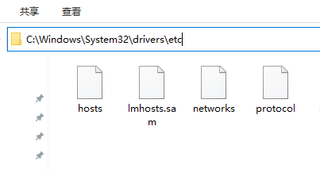
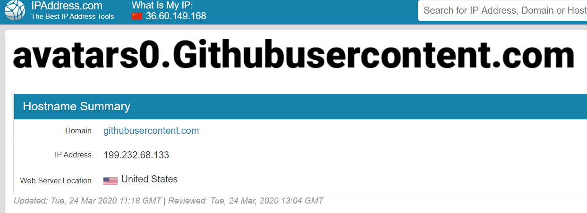

# 基于Spring Boot与 Vue的电商项目

## :notebook_with_decorative_cover:请查看[前后端分离的SpringBoot与Vue开发电商页面笔记](https://github.com/hex39/Vue_SpringBoot_shop/blob/master/前后端分离的SpringBoot与Vue开发电商页面.md)

## :floppy_disk:项目展示：


:point_right:================================================================:point_left:

发现没用梯子登录github，md文件的图片都加载不出来了！

百度一波，有解决方法：使用HOSTS加速对github网站加载的资源网站域名解析：

修改 C:\Windows\System32\drivers\etc 中的hosts文件（PS：若没有修改权限，可以鼠标右键，属性，安全，修改权限。或者将hosts文件复制到桌面，修改之后，复制到原文件夹）



使用这个网站查询  `avatars0.githubusercontent.com` 得到最新地址：



在本地hosts文件末尾添加查到的最新IP Address：

```hosts
# GitHub Start
最新IP .githubusercontent.com
# GitHub End
```

刷新github，图片也能流畅加载了，gif图也彳亍了。~~速度还是挺慢的，还得靠梯子去下载~~

:point_right:===========================================================​=====:point_left:

嫌弃了git本地仓库直接建立在桌面，浪费了C盘的空间，我在D盘又新建了文件夹，将git仓库初始化。发现clone下载速度巨慢，通过设置代理socks：1080的方式，让下载速度变快：

```c
git config --global http.proxy 'socks5://127.0.0.1:1080'
git config --global https.proxy 'socks5://127.0.0.1:1080'
```

可是这个方法只能加速 https 的速度，我再想要push的时候，每次都需要输入密码。

把换成了SSH的方式：

```c
$ git remote -v                   //查看传输方式
```

```c
$ git remote rm origin            //移除当前方式
```

```c
$ git remote add origin SSH地址
//设置成SSH方式
```

使用git在本地新建一个分支后，需要做远程分支关联，如果没有关联，git会在下面的操作中提示你显示的添加关联。关联目的是在执行git pull, git push操作时就不需要指定对应的远程分支，你只要没有显示指定，git pull的时候，就会提示你。

```c
$ git branch --set-upstream
```

$ git push -u origin master 上面命令将本地的master分支推送到origin主机，同时指定origin为默认主机，后面就可以不加任何参数使用git push了。

```
$ git push -u origin master
```

接下来就能无脑 git push / pull  命令了！

