# 前后端分离的SpringBoot与Vue开发电商页面

- ### 简介

  前端页面使用了vue框架，而后端则使用了springboot与mybatis。

  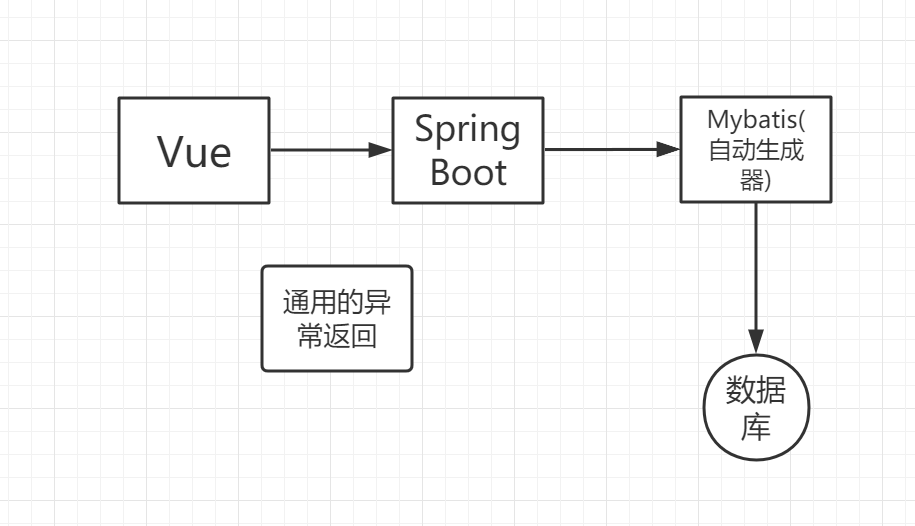

- ### vue的使用

  ​	打开vue的官网，因为是国人开发所以阅读网站非常方便！

  ​	在HBuildX里面创建普通html项目，

  ​	在项目的index.html 里引入：

  ```xml
  <!-- 开发环境版本，包含了有帮助的命令行警告 -->
  <script src="https://cdn.jsdelivr.net/npm/vue/dist/vue.js"></script>
  ```

  ​	页面的body中需要一个大的div，他是一个整体的容器，来供vue进行管理，如：

  ```xml
  <div id="app">
    {{message}}
  </div>
  ```

  ​	页面的script部分是vue用来进行数据交互的

  ```js
  
  var app = new Vue({
    el: '#app',
    data: {
      message: 'Hello Vue!'
    }
  })
  ```

  ​	我是这么理解的：

  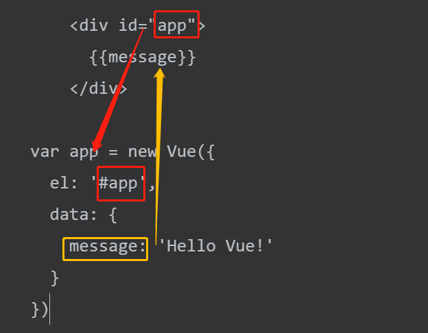

  ​	el将id挂载，data将数据传到message里

  

  ### 页面展示效果

  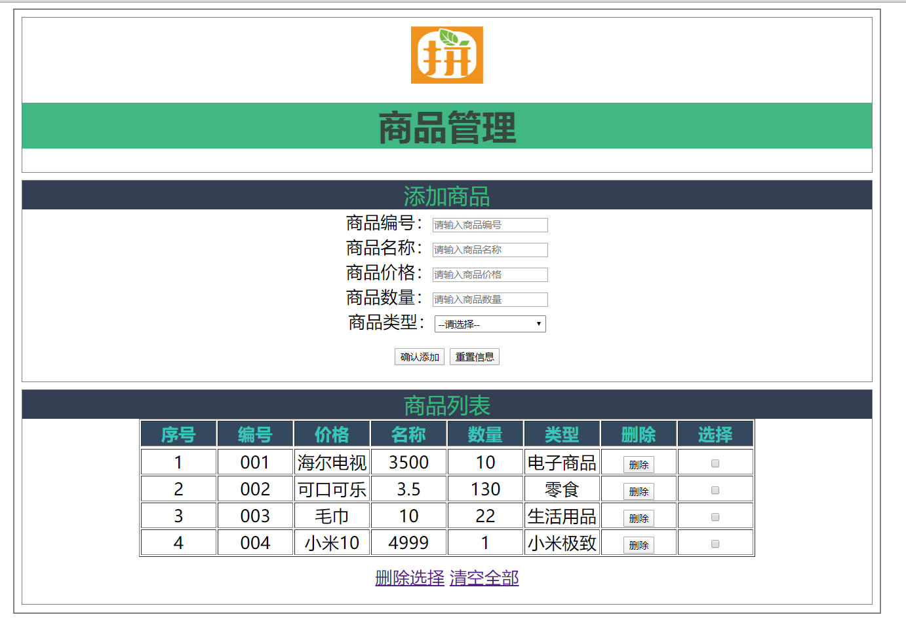

  

  ### 前端头部页面实现

  把页面分割成三个部分：

  head部，form部，table部；

  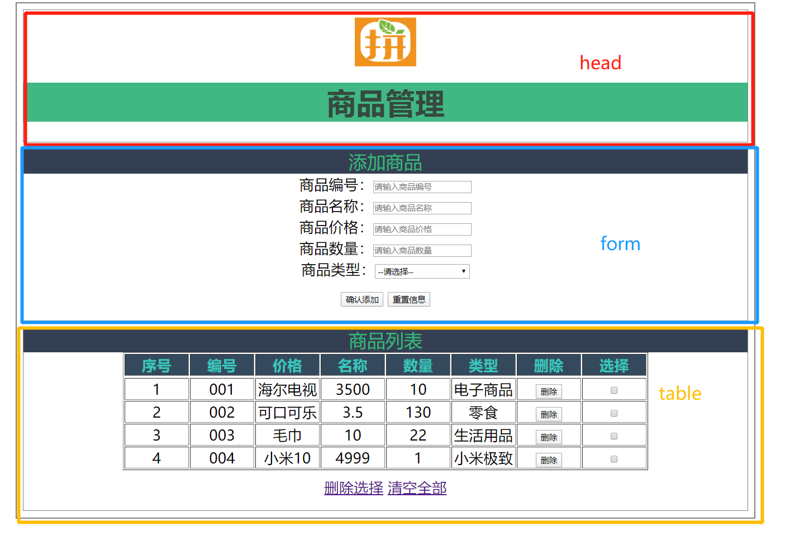

  首先搞三个div

  ```html
<body>
      <div id="container">
          <div id="head"></div> 
          <div id="form-warp"></div> 
          <div id="table-warp"></div> 
      </div>
  </body>
  ```
  
  ```html
<head>
      <meta charset="utf-8" />
      <title>并夕夕电商页</title>
      <style>
          #container{
              margin:0 auto;
              text-align: center;
              width: 1000px;
              border: 2px solid gray;
          }
      </style>
  </head>
  ```
  
  因为div没有任何东西，成了一条直线，往里面填充内容即可。

  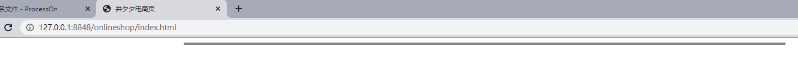

  经过很久时间，不断调整的样式后：

  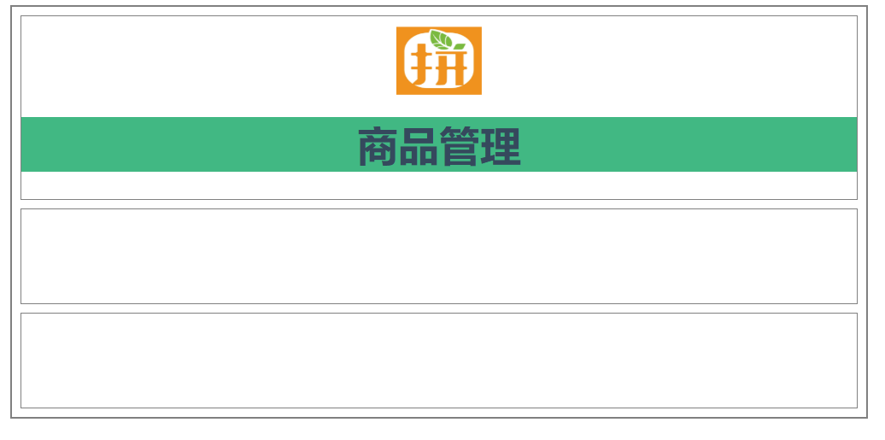

  css样式：

  ```css
<style>
      #container{
          margin: 0 auto;
          text-align: center;
          width: 1000px;
          border: 2px solid gray;
      }
  
      .header{
          margin: 10px;
          border: 1px solid gray;
      }
      .header .titile{
          color: rgb(53,73,93);
          background: rgb(65,184,131);
      }
  
      .logo{
          position: relative;
          top: 12px;
      }
      .form-warp{
          margin: 10px;
          padding-bottom: 10px;
          border: 1px solid gray;
          height: 100px;
      }
  
      .table-warp{
          margin: 10px;
          padding-bottom: 10px;
          border: 1px solid gray;
          height: 100px;
      }
  </style>
  ```
  
  body体：

  ```html
<body>
  
      <div id="container">
          <div class="header">
              
              <h1 class="titile">商品管理</h1>
          </div>
          <div class="form-warp"></div>
          <div class="table-warp"></div>
      </div>
  
  </body>
  ```
  
  

  

  ### 添加商品页面的实现

  对商品页div(form-warp)进行添加

  ```html
  <div class="form-warp">
      <div class="sub_title">添加商品</div>
      <div class="content">
          商品编号：<input type="text" placeholder="请输入商品编号"><br/>
          商品名称：<input type="text" placeholder="请输入商品名称"><br/>
          商品价格：<input type="text" placeholder="请输入商品编号"><br/>
          商品数量：<input type="text" placeholder="请输入商品价格"><br/>
          商品类型：<select>
          <option value="" disabled="disabled">--请选择--</option>
          <option value="">电子产品</option>
          <option value="">食品</option>
          </select>
      </div>
      <div class="form-btn">
          <button>确认添加</button>
          <button>重置信息</button>
      </div>
  </div>
  ```

  调整[添加商品]的字样，列间距：

  ```css
  .form-warp{
  margin: 10px;
  padding-bottom: 10px;
  border: 1px solid gray;
  
  }
  .sub_title{
  color: rgb(65,184,131);
  background: rgb(53,73,93);
  font-size: 30px;
  }
  
  .form-warp .content{
  line-height: 35px;
  }
  
  .form-warp select{
  width: 154px;
  height: 24px;
  }
  .form-btn{
  padding: 12px;
  }
  ```

  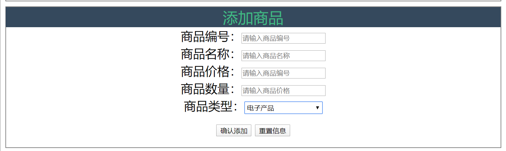

  

  ### 商品列表的实现

  对div(table-warp)进行添加：

  ```html
  <div class="table-warp">
      <div class="sub_title">商品列表</div>
      1111
      <table border="1" align="center">
          <tr>
              <th>序号</th>
              <th>编号</th>
              <th>名称</th>
              <th>价格</th>
              <th>数量</th>
              <th>类型</th>
              <th>删除</th>
              <th>选择</th>
          </tr>
          <tr>
              <td>序号1</td>
              <td>编号1</td>
              <td>名称1</td>
              <td>价格1</td>
              <td>数量1</td>
              <td>类型1</td>
              <td><button>删除</button></td>
              <td><input type="checkbox"></td>
          </tr>
      </table>
  
      <div class="form-btn">
          <a>删除选择</a>
          <a>清空全部</a>
      </div>
  </div>
  </div>
  ```

  css样式：

  ```css
  .table-warp{
      margin: 10px;
      padding-bottom: 10px;
      border: 1px solid gray;
  
  }
  .table-warp th{
      width: 80px;
      color: #ffff;
      background: rgb(53,73,93);
  }
  ```

  注意：1111是负责对选中的数组进行回显预留的位置

  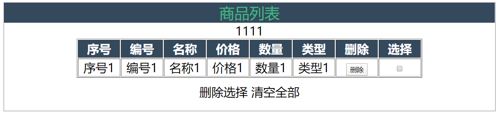


## 页面与Vue的绑定

1. 引入包括网络与本地引入，本项目使用了网络src；
2. vue实现了图片url拼接的显示；
3. 数组里读取数据并加载到option下拉条；

```html
<select>
    <option value="" disabled="disabled">--请选择--</option>
    <option v-for="type in goodsType">{{type}}</option>
<select/>
```

```html
<script>
    var vm = new Vue({
        el:"#container",
        data:{
            imgUrl:"./img/",
            imgName:'1.png',
            goodsType:['零食','电子商品','生活用品']
        }
    })
</script>
```

## 商品列表的动态显示

设置一个goodsArray数组存储商品数据。先写死数据。

这里for指令中的 :key 作用是 当数组元素顺序发生变更时，dom会和数据同步更新。

```html
<tr v-for="(item,index) in goodsArray" :key="item.id">
    <td>{{index}}</td>
    <td>{{item.id}}</td>
    <td>{{item.name}}</td>
    <td>{{item.price}}</td>
    <td>{{item.num}}</td>
    <td>{{item.type}}</td>
    <td><button>删除</button></td>
    <td><input type="checkbox"></td>
</tr>
```

```javascript
<script>
    var vm = new Vue({
        el:"#container",
        data:{
            imgUrl:"./img/",
            imgName:'1.png',
            goodsType:['零食','电子商品','生活用品'],
            goodsArray:[
                {id:'001',name:'海尔电商',price:3500,num:10,type:"电子商品"},
                {id:'002',name:'可口可乐',price:3.5,num:100,type:"零食"},
                {id:'003',name:'毛巾',price:10,num:20,type:"生活用品"},
            ]
        }
    })
</script>
```

## 商品添加模块添加商品

我先创个空的goods数组，目的是暂存添加商品模块添加进来的goods数据；

再将[确认添加]按钮绑定个addGoods的函数；

最后把goods数组存到goodsArray数组，然后清空goods数组，防止累积；~~工具数组实锤了~~；

```html
<div class="content">
    商品编号：<input type="text" placeholder="请输入商品编号" v-model="goods.id"><br/>
    商品名称：<input type="text" placeholder="请输入商品名称" v-model="goods.name"><br/>
    商品价格：<input type="text" placeholder="请输入商品编号" v-model="goods.price"><br/>
    商品数量：<input type="text" placeholder="请输入商品价格" v-model="goods.num"><br/>
    商品类型：<select v-model="goods.type">
    <option value="" disabled="disabled">--请选择--</option>
    <option v-for="type in goodsType">{{type}}</option>
    </select>
</div>
<div class="form-btn">
    <button @click="addGoods">确认添加</button>
    <button>重置信息</button>
</div>
```

```js
<script>
    var vm = new Vue({
        el:"#container",
        data:{
            imgUrl:"./img/",
            imgName:'1.png',
            goodsType:['零食','电子商品','生活用品'],
            goodsArray:[
                {id:'001',name:'海尔冰箱',price:3500,num:10,type:"电子商品"},
                {id:'002',name:'可口可乐',price:3.5,num:100,type:"零食"},
                {id:'003',name:'毛巾',price:10,num:20,type:"生活用品"},
            ],
            goods:{
                id:'',
                name:'',
                price:'',
                num:'',
                type:''
            },
        },
        methods:{
            addGoods(){
                this.goodsArray.push(this.goods);
                this.goods = {};
            }
        }
    })
</script>
```

## 商品列表的删除功能

商品列表怎么删除商品呢？

1. 每个商品行，都有删除按钮，传入index值给splice()函数处理；

   ```js
   delGoods(index){
   	this.goodsArray.splice(index,1)
   },
   ```

2. 多个商品行怎么删除？

   在checkbox里面，外层循环goodsArray传来index，v-model再把index传到delArray里面，delArray负责存放需要删除的数组索引，先进行由小到大的排序 ~~因为不知道你点击的顺序~~ 然后通过for循环逐一对goodsArray删除。for循环：删除一个，就上去下一个。

   ```html
   <td><button @click="delGoods(index)">删除</button></td>
   <td><input type="checkbox" :value="index" v-model="delArray"></td>
   ```

   ```js
   data:{ 	delArray:[], }
   ```

   ```js
   delSelected(){
       this.delArray.sort((a,b)=>{
           return a-b;
       });
       for(var i=0;i<this.delArray.length;i++){
           this.goodsArray.splice(this.goodsArray[i]-i,1);
       }
       this.delArray=[];
   },
   ```

3. 清空数组，直接置空goodsArray数组即可；

   ```js
   clearGoodsArray(){
       this.goodsArray=[];
   }
   ```

## Springboot项目搭建

这部分非常重要。

创建springboot项目，勾选web，引入maven。

#### src包：

在shopApplication启动类平级目录创5个包：

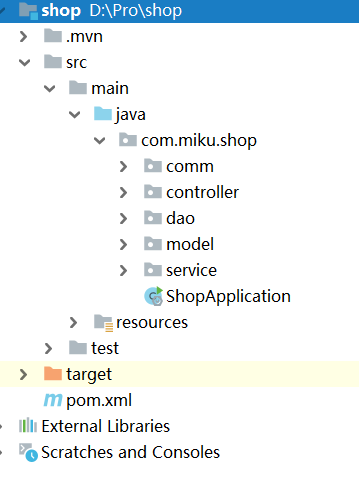

comm：用于请求处理，通用异常类，错误类，ExceptionHandler等；

controller：与前端交互，URL映射传参等，调用service；

dao：放个mapper接口，声明了xml文件的sql语句；

model：与数据库对应，放个goods类，与表名对应；

service：找到dao，负责业务逻辑处理，用到啥写啥；

application：~~工具类~~需要加上包扫描@MapperScan("com.miku.shop.dao")和    														AOP@EnableAspectJAutoProxy(proxyTargetClass = true)

#### resources包：


mapping：映射文件存放；

static：网站静态资源存放；

templates：模板页存放；

application.properties：springboot配置文件，一般用yml格式；

generatorConfig.xml：数据库反向生成配置文件；

### 先试试运行springboot

- 修改pom文件：

  ```xml
  <properties>
      <java.version>1.8</java.version>
      <project.buid.sourceEncoding>UTF-8</project.buid.sourceEncoding>
      <maven.compiler.source>1.8</maven.compiler.source>
      <maven.compiler.target>1.8</maven.compiler.target>
  </properties>
  ```

- 修改配置端口：

  ```properties
  server.port=8081
  ```

- controller代码：GoodsController.java

  ```java
  @RestController				//RestController用于返回值为json等情况
  public class GoodsController {
  	@RequestMapping("/test")
      public String test(){
          return "test";
      }
  }
  ```

- 访问<http://localhost:8081/test> 发现成功返回数据

  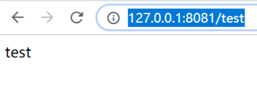

### 加载Thymeleaf 模板

Thymeleaf是一个流行的模板引擎，该模板引擎采用Java语言开发，模板引擎是一个技术名词，是跨领域跨平台的概念，在Java语言体系下有模板引擎，在C#、PHP语言体系下也有模板引擎。除了thymeleaf之外还有Velocity、FreeMarker等模板引擎，功能类似。

Thymeleaf的主要目标在于提供一种可被浏览器正确显示的、格式良好的模板创建方式，因此也可以用作静态建模。你可以使用它创建经过验证的XML与HTML模板。

我的理解就是他用来帮spring读取html等视图；与freemaker类似；

- 引入pom文件：

  ```xml
  <dependency>
      <groupId>org.springframework.boot</groupId>
      <artifactId>spring-boot-starter-thymeleaf</artifactId>
  </dependency>
  ```

- 增加配置：

  ```properties
  spring.thymeleaf.prefix=classpath:/templates
  spring.thymeleaf.suffix=.html
  ```

- 添加ModelAndView视图解析器：

  ```java
  @Controller
  public class GoodsController {
  	@RequestMapping("/test")
      @ResponseBody
      public String test(){
          return "test";
      }
      @RequestMapping("/index")
      public ModelAndView index(){
          ModelAndView modelAndView = new ModelAndView("/index.html");
          return modelAndView;
      }
  }
  ```

### 数据库的创建

SQLyog创名为shop的数据库

表结构：

| 字段名称 |   字段类型   |   备注   |
| :------: | :----------: | :------: |
|    id    |     int      | 主键自增 |
|   name   | varchar(20)  |   非空   |
|  price   | decimal(8,2) |   非空   |
|   num    |     int      |  默认1   |
|   type   | varchar(10)  |   非空   |

```sql
CREATE TABLE goods(
				id INT UNSIGNED auto_increment NOT NULL comment '商品ID',
				name VARCHAR(20) NOT NULL comment '商品名称',
				price DECIMAL(8,2) NOT NULL comment '商品售价价格',
			    num INT NOT NULL DEFAULT 1 comment '商品数量',
				type VARCHAR(10) NOT NULL comment '商品类型',
				PRIMARY KEY pk_productid(id)
 )engine = innodb comment '商品信息表';
```

插入2行数据：

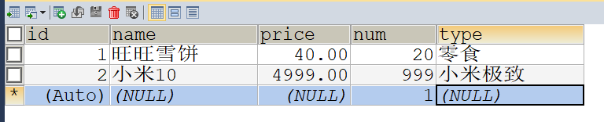

### Mybatis获取MySQL数据库的数据

mybatis我认为是一种持久层的框架，使用了xml将sql与程序实现了解耦；

- 集成mybatis逆向工程

  pom文件：

  ```xml
  <dependency>
      <groupId>mysql</groupId>
      <artifactId>mysql-connector-java</artifactId>
      <version>5.1.35</version>
  </dependency>
  <dependency>
      <groupId>org.mybatis.generator</groupId>
      <artifactId>mybatis-generator-core</artifactId>
      <version>1.3.2</version>
  </dependency>
  
  <build>
      <pluginManagement>
          <plugins>
              <plugin>
                  <groupId>org.apache.maven.plugins</groupId>
                  <artifactId>maven-compiler-plugin</artifactId>
                  <configuration>
                      <source>1.8</source>
                      <target>1.8</target>
                  </configuration>
                  <version>3.3</version>
              </plugin>
              <plugin>
                  <groupId>org.mybatis.generator</groupId>
                  <artifactId>mybatis-generator-maven-plugin</artifactId>
                  <version>1.3.2</version>
                  <dependencies>
                      <dependency>
                          <groupId>mysql</groupId>
                          <artifactId>mysql-connector-java</artifactId>
                          <version>5.1.35</version>
                      </dependency>
                  </dependencies>
                  <configuration>
                      <!--配置文件的路径-->              <configurationFile>src/main/resources/generatorConfig.xml</configurationFile>
                      <overwrite>true</overwrite>
                  </configuration>
              </plugin>
          </plugins>
      </pluginManagement>
  
  
      <plugins>
          <plugin>
              <groupId>org.springframework.boot</groupId>
              <artifactId>spring-boot-maven-plugin</artifactId>
          </plugin>
      </plugins>
  </build>
  ```

- 创建generatorConfig.xml

  ```xml
  <?xml version="1.0" encoding="UTF-8"?>
  <!DOCTYPE generatorConfiguration
          PUBLIC "-//mybatis.org//DTD MyBatis Generator Configuration 1.0//EN"
          "http://mybatis.org/dtd/mybatis-generator-config_1_0.dtd">
  <generatorConfiguration>
      <context id="test" targetRuntime="MyBatis3">
          <plugin type="org.mybatis.generator.plugins.EqualsHashCodePlugin"></plugin>
          <plugin type="org.mybatis.generator.plugins.SerializablePlugin"></plugin>
          <plugin type="org.mybatis.generator.plugins.ToStringPlugin"></plugin>
          <commentGenerator>
              <!-- 这个元素用来去除指定生成的注释中是否包含生成的日期 false:表示保护 -->
              <!-- 如果生成日期，会造成即使修改一个字段，整个实体类所有属性都会发生变化，不利于版本控制，所以设置为true -->
              <property name="suppressDate" value="true" />
              <!-- 是否去除自动生成的注释 true：是 ： false:否 -->
              <property name="suppressAllComments" value="true" />
          </commentGenerator>
          <!--数据库链接URL，用户名、密码 -->
          <jdbcConnection driverClass="com.mysql.jdbc.Driver"
                          connectionURL="jdbc:mysql://localhost:3306/shop"
                          userId="root"
                          password="123456">
          </jdbcConnection>
          <javaTypeResolver>
              <!-- This property is used to specify whether MyBatis Generator should
                  force the use of java.math.BigDecimal for DECIMAL and NUMERIC fields, -->
              <property name="forceBigDecimals" value="false" />
          </javaTypeResolver>
          <!-- 生成模型的包名和位置 -->
          <javaModelGenerator targetPackage="com.miku.shop.model"
                              targetProject="src/main/java">
              <property name="enableSubPackages" value="true" />
              <property name="trimStrings" value="true" />
          </javaModelGenerator>
          <!-- 生成映射文件的包名和位置 -->
          <sqlMapGenerator targetPackage="mapping"
                           targetProject="src/main/resources">
              <property name="enableSubPackages" value="true" />
          </sqlMapGenerator>
          <!-- 生成DAO的包名和位置 -->
          <javaClientGenerator type="XMLMAPPER"
                               targetPackage="com.miku.shop.dao"
                               targetProject="src/main/java">
              <property name="enableSubPackages" value="true" />
          </javaClientGenerator>
  
          <!-- 要生成哪些表 -->
          <table tableName="`goods`" domainObjectName="Goods" enableCountByExample="false"
                 enableUpdateByExample="false" enableDeleteByExample="false"
                 enableSelectByExample="false" selectByExampleQueryId="false">
              <generatedKey column="id" sqlStatement="Mysql" identity="true"/>
          </table>
  
      </context>
  </generatorConfiguration>
  ```

- 配置maven运行：将按照generatorConfig.xml的配置反向生成

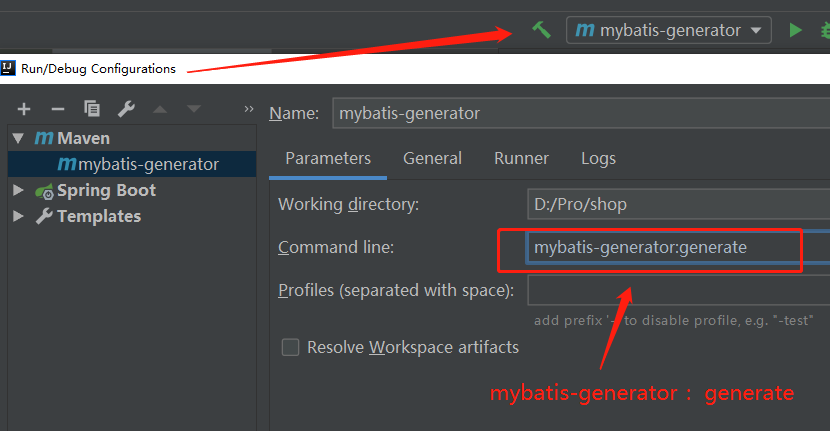

- 操作数据库

使用了druid连接！~~阿里牛逼~~

- pom文件添加依赖：

  ```xml
  <dependency>
      <groupId>com.alibaba</groupId>
      <artifactId>druid</artifactId>
      <version>1.1.12</version>
  </dependency>
  
  <dependency>
      <groupId>org.mybatis.spring.boot</groupId>
      <artifactId>mybatis-spring-boot-starter</artifactId>
      <version>1.3.3</version>
  </dependency>
  ```

- 修改配置文件

  ```properties
  #配置mybatis
  mybatis.mapper-locations=classpath:mapping/*.xml
  spring.datasource.name=shop
  spring.datasource.url=jdbc:mysql://localhost:3306/shop?serverTimezone=UTC&useUnicode=true&characterEncoding=UTF-8
  spring.datasource.username=root
  spring.datasource.password=123456
  
  #使用druid连接池
  spring.datasource.type=com.alibaba.druid.pool.DruidDataSource
  spring.datasource.driver-class-name=com.mysql.jdbc.Driver
  ```

- 启动类上添加注解

  ```java
  @SpringBootApplication
  @MapperScan("com.miku.shop.dao")
  ```

- controller开发

  *因为到后面已经完善了这部分代码，所以功能会多一些，是最后完成版的代码，不想重写了，偷懒一波*

  > 通过Maven反向生成了模型model包与Goods类对应了goods表，
  >
  > 以及生成了关联的GoodsMapper.xml映射文件，
  >
  > 以及dao包的GoodsMapper类；
  >
  > 
  >
  > 这个xml的<mapper namespace>绑定了GoodsMapper，这个dao包的
  >
  > mapper通常是个接口，定义了一些抽象方法，借由xml的sql语句来实现，如有复杂查询就自己在xml写sql语句，然后mapper定义一个同名方法就能搞查询了。
  >
  > 这个mapper上没有注解。
  >
  > 
  >
  > service包下定义一个接口，GoodService，~~解耦合用的工具接口~~，创实现类GoodsServiceImpl，加上@Serivce注解，调用了dao包的mapper，给mapper一个@Resource注入，反手就能使用mapper里面齐全的数据库操作，美滋滋。
  >
  > 
  >
  > 创GoodsController，处理前端的请求，是真正的重点。

  

  ```java
  @Controller
  @RequestMapping("/goods")
  public class GoodsController {
      @RequestMapping("/get")
      @ResponseBody
      public CommonRes getGoods(@RequestParam(name="id") Integer id) throws BusinessException {
          Goods goods = goodsService.getGoods(id);
          if (goods == null) {
              throw new BusinessException(EmBusinessError.NO_OBJECT_FOUND);
          }else {
              return CommonRes.create(goods);
          }
      }
  }
  ```

  *新版本RestController注解可以使用：@GetMapping@PostMapping@PutMapping@DeleteMapping@PatchMapping简化*

### 通用异常处理

创建通用返回值包comm：

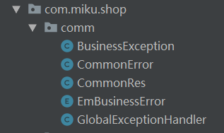

创建请求对应处理类：CommonRes：请求处理成功或失败：

```java
public class CommonRes {
    //表明请求处理的结果 success OR fail
    private String status;
	// success->Object;fail->错误码
    private Object data;
    //定义成功方法，自动返回success
	public static CommonRes create(Object object) {
        return create(object, "success");
    }
	//定义一个通用的返回值对象,返回了错误码，将结果封装 
    public static CommonRes create(Object object, String status) {
        CommonRes commonRes = new CommonRes();
        commonRes.setStatus(status);
        commonRes.setData(object);
        return commonRes;
    }
	public String getStatus() {
        return status;
    }
	public void setStatus(String status) {
        this.status = status;
    }
	public Object getData() {
        return data;
    }
	public void setData(Object data) {
        this.data = data;
    }
}
```

创建错误处理类：CommonError：

```java
//错误处理
public class CommonError {
    //错误码
    private Integer errCode;
    //错误描述
    private String errMsg;
	
    public CommonError(Integer errCode, String errMsg) {
        this.errCode = errCode;
        this.errMsg = errMsg;
    }
	
    public CommonError(EmBusinessError emBusinessError) {
        this.errCode = emBusinessError.getErrCode();
        this.errMsg = emBusinessError.getErrMsg();
    }

    public Integer getErrCode() {
        return errCode;
    }
	public void setErrCode(Integer errCode) {
        this.errCode = errCode;
    }
	public String getErrMsg() {
        return errMsg;
    }
	public void setErrMsg(String errMsg) {
        this.errMsg = errMsg;
    }
}
```

创建业务通用Error信息的枚举类：EmBusinessError：放了一些错误码

```java
public enum EmBusinessError {
    NO_OBJECT_FOUND(10000, "请求对象不存在"),
    UNKNOE_ERROR(10001, "未知错误"),
    NO_HANDLER_FOUND(10002, "找不到对应路径"),
    BIND_EXCEPTION_FOUND(10003, "参数错误"),
	;
	
    private Integer errCode;
    private String errMsg;
	//返回错误码与对应的错误信息
    EmBusinessError(Integer errCode,String errMsg){
        this.errCode=errCode;
        this.errMsg =errMsg;
    }
	public Integer getErrCode() {
        return errCode;
    }
	public void setErrCode(Integer errCode) {
        this.errCode = errCode;
    }
	public String getErrMsg() {
        return errMsg;
    }
	 public void setErrMsg(String errMsg) {
        this.errMsg = errMsg;
    }
}
```

### 控制器与参数异常统一处理

当非请求参数错误时，我们怎么处理这个异常呢？

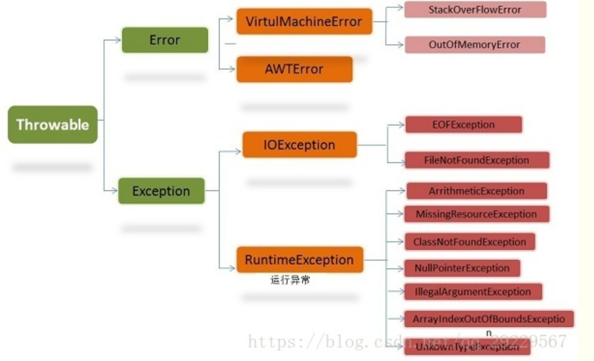

创建异常捕获类：BussinessException：

```java
public class BusinessException extends Exception{
    //这个错误处理类名字虽叫error，其实只是用来测试返回的错误码罢了。
    private CommonError commonError;
	//又对错误码处理类进行了封装
    public BusinessException(EmBusinessError emBusinessError) {
        super();
        //把枚举类的信息传到CommonError里。
        this.commonError = new CommonError(emBusinessError);
    }

    public CommonError getCommonError() {
        return commonError;
    }
	public void setCommonError(CommonError commonError) {
        this.commonError = commonError;
    }
}
```

！真正的通用异常处理：GlobalExceptionHandler：

```xml
<groupId>org.springframework.boot</groupId>
<artifactId>spring-boot-starter-aop</artifactId>
```

做了切面，只要访问controller，所有异常都可以进行处理。

```java
@EnableAspectJAutoProxy(proxyTargetClass = true)
```

增强版@ControllerAdvice，这注解有三个用处：全局异常处理、全局数据绑定、全局数据预处理。在 Spring Boot 中可以直接使用。

```java
@ControllerAdvice
public class GlobalExceptionHandler {
    @ExceptionHandler(Exception.class)
    @ResponseBody
    public CommonRes doError(HttpServletRequest request, HttpServletResponse response, Exception exception) {
        if (exception instanceof BusinessException) {
            return CommonRes.create(((BusinessException) exception).getCommonError(), "fail");
        } else if (exception instanceof NoHandlerFoundException){
            CommonError commonError = new CommonError(EmBusinessError.NO_HANDLER_FOUND);
            return CommonRes.create(commonError, "fail");
        } else if (exception instanceof ServletRequestBindingException){
            CommonError commonError = new CommonError(EmBusinessError.BIND_EXCEPTION_FOUND);
            return CommonRes.create(commonError, "fail");
        } else {
            CommonError commonError = new CommonError(EmBusinessError.UNKNOE_ERROR);
            return CommonRes.create(commonError, "fail");
        }
    }
}
```

404页面单独配置：

```properties
#配置404异常处理
#add-mappings true表示所有controller都没有命中，则由默认handler处理
#除static设置后其他文件若没有controller处理则报no-handler错误
spring.resources.add-mappings=true
spring.mvc.throw-exception-if-no-handler-found=true
spring.mvc.static-path-pattern=/static/**
```

## SpringBoot与Vue的整合

将HBuilderX创建的vue项目copy到static目录里即可，需要最新的jquery.min.js以及vue.js

### 商品查询：

1. xml写sql语句：

   ```xml
   <select id="findAll" resultMap="BaseResultMap"  >
     select
     <include refid="Base_Column_List" />
     from goods
   </select>
   ```

2. Dao添加方法：

   ```java
   List<Goods> findAll();
   ```

3. Service添加方法

   ```java
   List<Goods> findAll();
   ```

4. Controller添加方法：

   ```java
   @RequestMapping("/findAll")
   @ResponseBody
   public CommonRes findAll() throws BusinessException {
       List<Goods> lists =goodsService.findAll();
       if (lists == null) {
           throw new BusinessException(EmBusinessError.NO_OBJECT_FOUND);
       }else {
           return CommonRes.create(lists);
       }
   }
   ```

5. shop.html里添加show方法，通过网络，查询并显示所有商品；

   ```js
   show(){
       $.ajax({
           url: "/goods/findAll",
           contentType: "application/json;charset=utf-8",
           dataType: "json",
           success: function (data) {
               console.log(data);
               vm.goodsArray = data.data;
           }
       });
   }
   ```

6. 创vue的created方法，这是它的一个生命周期钩子函数，就是一个vue实例被生成后调用这个函数。一般可以在created函数中调用ajax获取页面初始化所需的数据。

   ```js
   created: function () { this.show() },
   ```

   目的是第一次访问时，进行渲染前，调用show()得到所有商品

### 商品添加/修改：

1. Service：

   ```java
   int insert(Goods goods);
   int updateByPrimaryKey(Goods goods);
   ```

2. Controller：

   ```java
   @RequestMapping(value = "/insertgoods",method = RequestMethod.POST)
   @ResponseBody
   public CommonRes insert(Goods goods) {
       int id = goodsService.insert(goods);
       return CommonRes.create(id);
   }
   
   @RequestMapping(value = "/updategoods",method = RequestMethod.POST)
   @ResponseBody
   public CommonRes update(Goods goods){
       int id = goodsService.updateByPrimaryKey(goods);
       return CommonRes.create(id);
   }
   ```

3. shop.html：

   ```js
   addGoods(){
       _this = this,
       $.ajax({
           url: "/goods/insertgoods",
           data: _this.goods,
           type: "post",
           success: function(){
               alert("添加成功！");
               _this.show();
           }, error: function (rel) {
               alert(rel+"添加失败！")
           }
       })
       _this.show(),
   },
   	updateGoods(){
           _this = this
           $.ajax({
               url: "/goods/updategoods",
               data: _this.goods,
               type: "post",
               success: function(){
                   alert("修改成功！");
                   _this.show();
               }, error: function (rel) {
                   alert(rel+"修改失败！")
               }
           })
           _this.show()
       },    
   ```

### 商品删除：

1. 因为需要在ajax中将数组转换成Json字符串，所以加上：

   ```xml
   <dependency>
      <groupId>com.fasterxml.jackson.core</groupId>
      <artifactId>jackson-databind</artifactId>
      <version>2.8.8.1</version>
   </dependency>
   ```

2. xml写sql语句：

   ```xml
   <delete id="deleteBatch">
       DELETE FROM goods where id in
       <foreach collection="array" item="id" open="(" separator="," close=")">
           #{id}
       </foreach>
   </delete>
   ```

   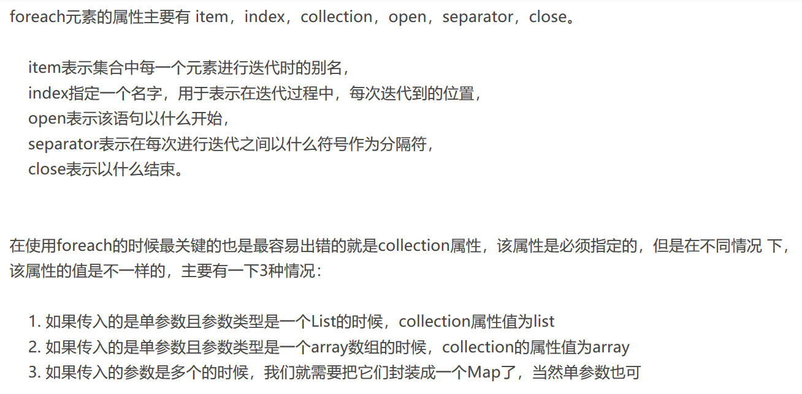

   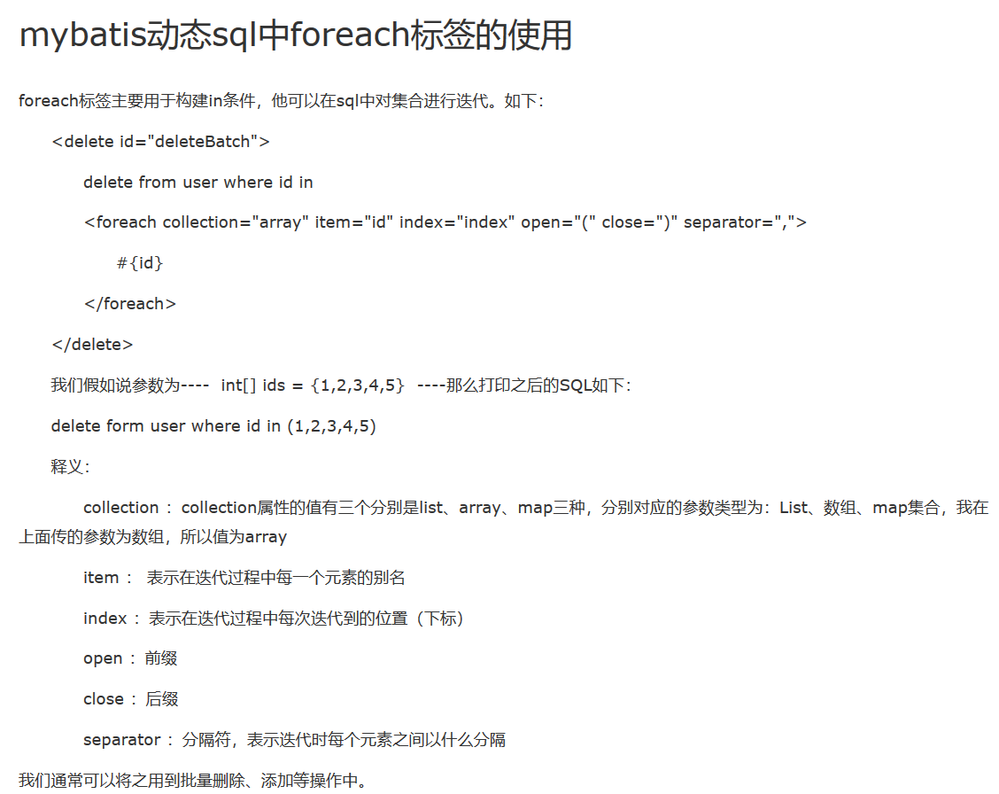

3. Dao：

   ```java
   void deleteBatch(Long[] ids);
   ```

4. Controller：

   ```java
   @RequestMapping(value = "/deletegoods",method = RequestMethod.POST)
   @ResponseBody
   public CommonRes delete(@RequestBody Long[]ids)throws BusinessException{
       //int id = goodsService.updateByPrimaryKey(goods);
       goodsService.deleteBatch(ids);
       return CommonRes.create("0");
   }
   ```

## 总结

springboot与vue整合搭建了仿并夕夕的商品页面，有一些功能还不完善，但我从中学到了许多，还需要加强vue的学习以及Mybatis的应用，数据的增删改查还需要反复练习！下一步是后台管理系统的开发，2020年3月19日。